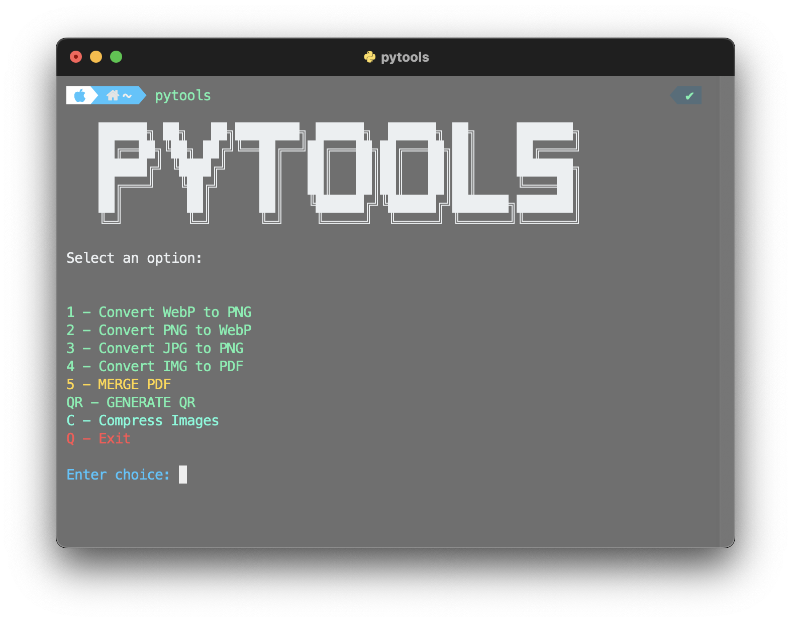

# PyTools

## Preview



## Installation

**In macOS / Linux:**

Needs:

-   Python 3.x

Run in the dir:

```bash
sudo make install
```

> When you run the installer, the necessary python libraries will be installed automatically.

> In case it doesn't install the dependences automatically, use: `python3 -m pip install -r ./requirements.txt` to install the libraries

> it might work on Linux

## Run app

Use `pytools` command in the terminal

## Contribute

You can help by sending changes and improvements to the repository by issues

-   Share the repo
-   Leave your star :)
-   Thank you for using!
